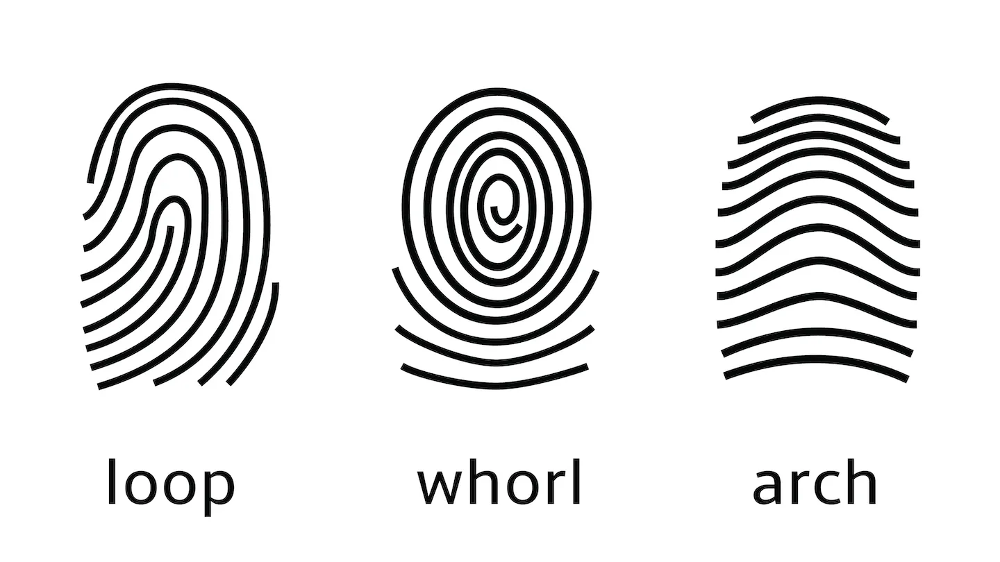

```{r setup, include=FALSE, message=FALSE}
library(tidyverse)
library(patchwork)
library(palmerpenguins)
library(broom)
library(infer)

options(digits = 4)
notes_theme = theme_minimal(base_size = 12, base_family = "Source Sans 3")
theme_set(notes_theme)
```

"Big picture" picture:

\vspace{1.5in}

| Quantity | Statistic | Parameter |
|------|------|------|
| Mean    |      |      |
| Proportion     |      |      |
| Standard Deviation     |      |      |
| Correlation     |      |      |
| Regression Coefficient     |      |      |


**Example:** Fingerprints are often used in criminal investigations even though the uniqueness of fingerprints has never actually been proven. While investigators use "minutiae", or small details in the fingerprint, to determine whether two fingerprints "match", they can exclude potential suspects if the fingerprint pattern is different. There are 3 major types of fingerprint patterns: 

```{r}
#| fig-align: 'center'

```

If we knew the population proportions for each of the three patterns, we could help investigators better understand the probability of seeing two fingerprints that look very similar but don't actually match. Our goal is to estimate $p_{\text{whorl}}$. 

On your own, compute $\hat{p}_{\text{whorl}}$ for two different samples and then contribute your answer to the graph on the board.

- $n=5$ (one hand): 

- $n=10$ (both hands): 

Sketch finished graphs here: 

\vspace{2in}

How do we feel about our estimates? 

\vspace{1in}

Now, visit the fingerprint sampler at <https://aluby.github.io/stat120/activities/10-fingerprints-live.html> and obtain 3 samples of size 5 and 3 samples of size 20. Record your data here and in the google sheet linked on the webpage.  

- $n=5$ (1): 

- $n=5$ (2): 

- $n=5$ (3): 

- $n=20$ (1): 

- $n=20$ (2): 

- $n=20$ (3): 


Sketch finished graphs here: 

\vspace{2in}


*In your own words:* provide explanations for:

::: callout-note
Population distribution

\vspace{.5in}
:::

::: callout-note
Sample distribution

\vspace{.5in}
:::

::: callout-note
Sampling distribution

\vspace{.5in}
:::

*In your own words:* explain why we used the fingerprint sampler website instead of using our class samples
