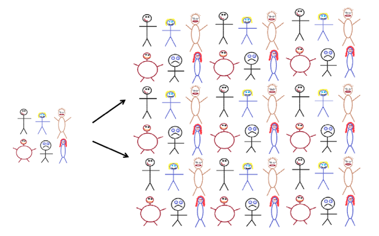

```{r setup, include=FALSE, message=FALSE}
library(tidyverse)
library(bookdown)
library(patchwork)
library(palmerpenguins)
library(broom)
library(infer)
library(ggformula)

options(digits = 4)
notes_theme = theme_minimal(base_size = 12, base_family = "Source Sans 3")
theme_set(notes_theme)
```

**"Big picture"** picture

\vspace{2in}


**Sampling distributions** for fingerprint example from last time (random samples)

```{r}
#| fig-width: 8
#| fig-height: 2.5

phats_5 <- c(0.4, 0.2, 0.2, 0.2, 0.2, 0.2, 0.6, 0.2, 0.6, 0.2, 0.4, 0.4, 0.4, 0.2, 0.2, 0, 0.2, 0.6, 0.4, 0.2, 0.2, 0.6, 0.1, 0, 0.8, 0.2, 0.2, 0.4, 0, 0.2, 0.8, 0.6, 0.2, 0.2, 0.6, 0.6, 0.4, 0.6, 0.2, 0, 0.2, 0.2, 0.2, 0.2, 0.2, 0.4, 0.4, 0, 0.4, 0.2, 0.2, 0.2, 0.2, 0.2, 0.2, 0, 0.4, 0, 0.4, 0.2, 0.2, 0.8, 0.6, 0, 0.4, 0.4, 0.4, 0.2, 0.2, 0.4, 0.2, 0, 0.4, 0, 0.4, 0.2, 0.2, 0.4, 0.4, 0.2, 0.4, 0.2, 0.6, 0.2, 0.8, 0.2, 0.8, 0.1, 0.4, 0, 0.1, 0, 0.6)

phats_20 <- c(0.4, 0.3, 0.45, 0.45, 0.25, 0.25, 0.35, 0.35, 0.35, 0.4, 0.4, 0.2, 0.15, 0.15, 0.15, 0.45, 0.45, 0.45, 0.25, 0.3, 0.3, 0.25, 0.1, 0.2, 0.35, 0.3, 0.25, 0.3, 0.7, 0.35, 0.6, 0.2, 0.3,  0.45, 0.3, 0.3, 0.2, 0.3, 0.25, 0.35, 0.4, 0.05, 0.45, 0.3, 0.3, 0.15, 0.3, 0.45, 0.15, 0.25, 0.45, 0.35, 0.25, 0.35, 0.2, 0.4, 0.3, 0.25, 0.25, 0.7, 0.4, 0.5, 0.4, 0.4, 0.35, 0.55, 0.25, 0.3, 0.3, 0.3, 0.15, 0.25, 0.5, 0.3, 0.4, 0.2, 0.5, 0.15, 0.25, 0.15, 0.4, 0.25, 0.4, 0.35, 0.4, 0.3, 0.35, 0.3, 0.25, 0.45, 0.8, 0.25, 0.6)


p1 <- gf_histogram(~phats_5, bins = 10, col = "white", fill = "black", xlab = "n=5", alpha = .7, boundary = 0) +  scale_x_continuous(breaks = seq(0,1,by=.2), limits = c(0,1)) + ylim(c(0,40))

p2 <- gf_histogram(~phats_20, bins = 12, col = "white", fill = "black", xlab = "n=20", alpha = .7, boundary = 0) + scale_x_continuous(breaks = seq(0,1,by=.2), limits = c(0,1)) + ylim(c(0,40))

p1 + p2
```

As _____ increases: 


The mean and standard deviation of the sampling distribution are:

```{r}
tibble(
  phat = c(phats_5, phats_20),
  sample = rep(paste0("n=", c(5, 20)), each = length(phats_20))
) |>
  group_by(sample) |>
  summarize(
    mean = mean(phat),
    sd = sd(phat)
  )
```

::: callout-note
## Standard Error:

Standard deviation of a statistic or a sampling distribution

:::

What's the **point estimate** for $p_{\text{whorl}}$ using the $n=20$ sample? The $n=5$? 

\vspace{1in}

Would you be surprised of $p_{\text{whorl}}$ was actually $0.39$? What about $0.80$? 

\vspace{1in}

::: callout-note
## Confidence Interval

An interval computed from sample data by a method that will capture the parameter for a specified percentage of all samples
:::

95% confidence interval using the standard error:

\vspace{1.5in}

::: callout-note
## Margin of Error

Range of values above and below a point estimate that defines the boundary of a confidence interval

\vspace{.25in}
:::

::: {.callout-warning appearance="simple"}
CI Misinterpretations

- A 95% CI contains 95% of the data from the population

$~$

- I am 95% sure that the mean of the sample will be in CI

$~$

- The probability that the parameter is in the CI is 95%

$~$

$~$

:::

Structure of a CI:

1.  I am \_\_\_ % confident
2.  that the \[population parameter in context\]
3.  is between \_\_\_\_ and \_\_\_\_ \[units\]

# The Bootstrap

So far, we've relied on generating lots of samples to construct sampling distributions (because we relied on the fingerprint sampler). For most situations, this is unrealistic.

**Example:** Let's consider our `penguin` friends. I'm interested in finding a 95% confidence interval for the mean flipper length of *all* Palmer Archipelago penguins. The mean flipper length is `r mean(penguins$flipper_length_mm, na.rm = TRUE)` and the standard deviation is `r sd(penguins$flipper_length_mm, na.rm = TRUE)`.

```{r}
#| fig-width: 4
#| fig-height: 2
ggplot(penguins, aes(x = flipper_length_mm)) + 
  geom_histogram(col = "white", bins = 20)
```

**Idea:** if we make a bunch of copies of our random sample, we should get something close to the population

\vspace{.25in}

{width="60%"}

**Bootstrap picture:** 

\vspace{2in}

Let's return to our penguins. I've made 100 bootstrap samples and found the mean for each one: 

```{r}
#| fig-width: 4
#| fig-height: 2

bootstrap_sampling_dist = penguins %>%
  select(species, flipper_length_mm) %>%
  rep_sample_n(size = nrow(penguins), reps = 100, replace = TRUE) %>%
  summarize(xbar = mean(flipper_length_mm, na.rm = TRUE)) 
  
bootstrap_sampling_dist %>%
  ggplot(., aes(x = xbar)) + 
  geom_dotplot() +
  labs(title = "Bootstrap Means")
```

The mean of this distribution is `r mean(bootstrap_sampling_dist$xbar)` and the standard deviation is `r sd(bootstrap_sampling_dist$xbar)`.

\vspace{2in}

::: callout-note 
## Bootstrap confidence interval:

\vspace{.5in}
:::

The magic of the bootstrap is that it works for any statistic we can compute from our sample! We simply have to follow these steps: 

1. Generate *bootstrap samples*: 
    - Sample from the original sample with replacement
    - Use the same sample size as original sample
2. Compute the statistic of interest for each bootstrap sample
3. Collect the statistics for many bootstrap samples to create the *bootstrap distribution*
4. Treat the *bootstrap distribution* as the *sampling distribution* to estimate the standard error

::: {.callout-warning appearance="simple"}
What happens when the bootstrap distribution is not symmetric? 

:::
