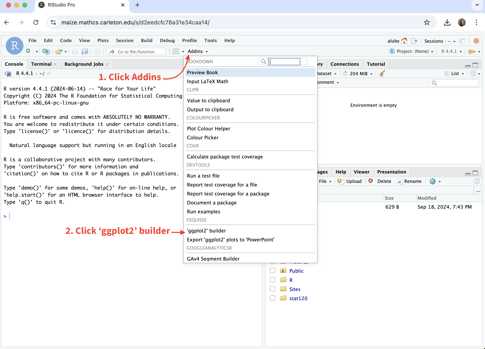
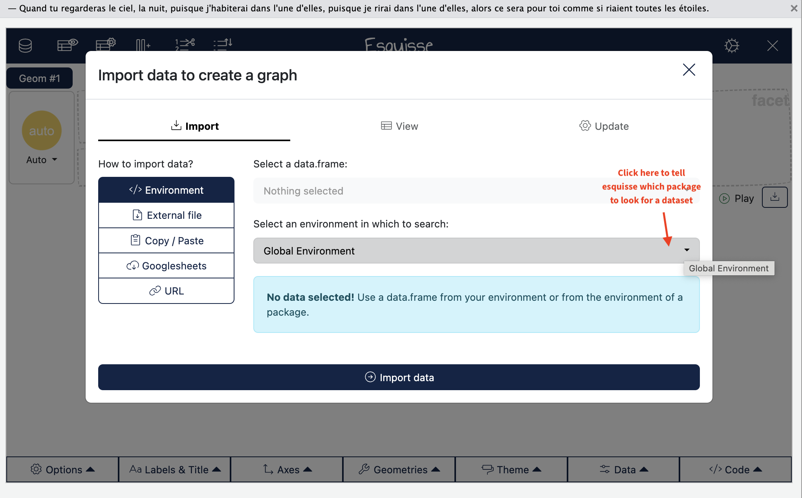
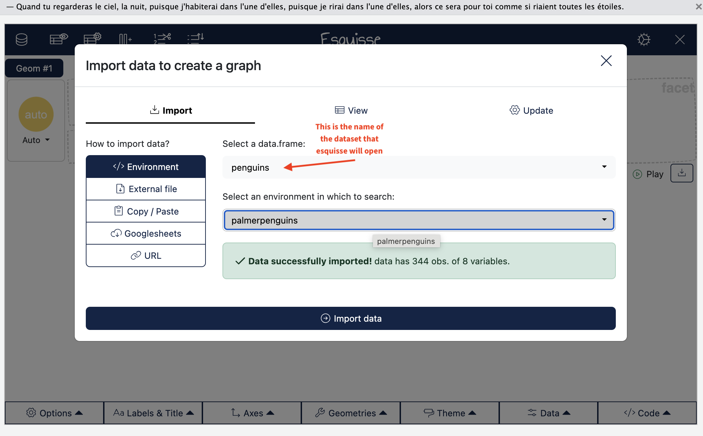
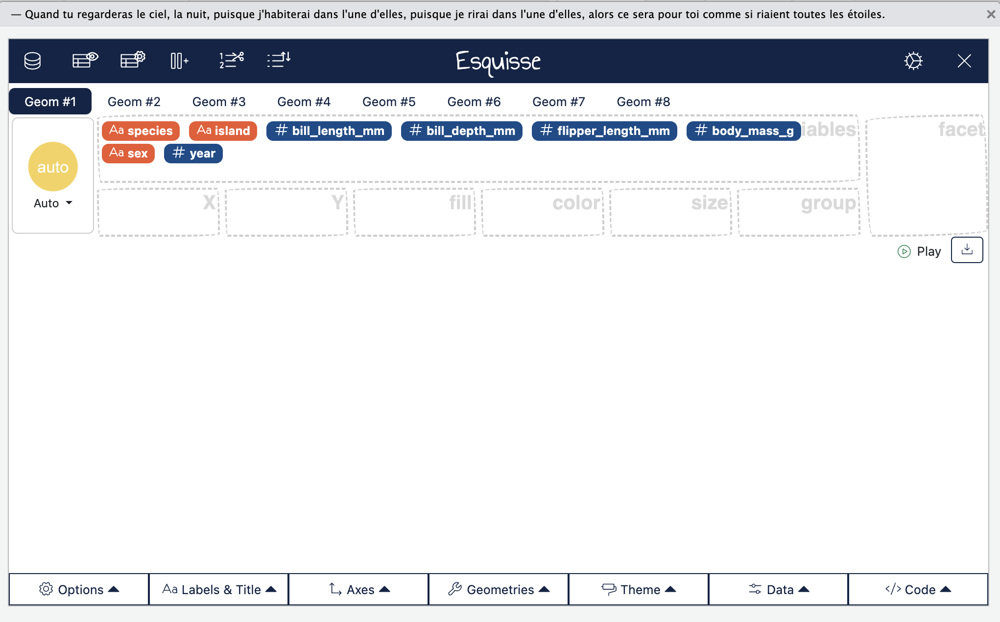
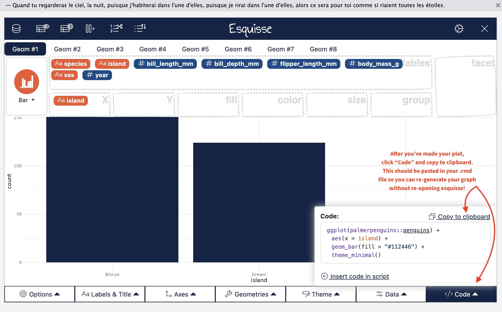

```{r setup}
library(tidyverse)
library(bookdown)
library(infer)
library(ragg)
options(digits = 4)
notes_theme = theme_minimal(
 # base_family = "Montserrat", 
  base_size = 14)
theme_set(notes_theme)
```

There are **lots** of different ways to make plots in R/RStudio. If you're reading the R manual, you'll see some code that uses `base` R for graphics and other code that uses `ggplot2` for graphics. I prefer `ggplot2` because I find the logic more consistent and the default graphs more visually appealing, so most of my example code will use `ggplot2` syntax.

We're also going to use the `esquisse` package to get familiar with the syntax for making graphs and be able to play around with different graphics options without using code.

To access it, click "addins" and then "ggplot2 builder"



It might take a few moments, but the following window should open up. `esquisse` is able to see any data that you have loaded in your R environment. Since I don't have any data loaded in, I have to tell it where to look. Type `palmerpenguins` in the "Select an environment in which to search" menu.



Now we can choose a dataset to open up with `esquisse`. Penguins should appear in the menu, then click "import data"



When the data is loaded, you should see the menu below. Each of the variables appears as a colored box in the "variables" box. Drag a variable to an `aesthetic` (X-axis, Y-axis, fill, color, size, or group) to create a plot! You can play around with different combinations to get the plot that you are looking for.



Once we're done, we want to obtain the code to make the plot, so that we can recreate it and make sure it shows up in our homework .rmd files. Clicking "code" will bring up the `ggplot2` code used to make the plot. Copy this into the appropriate place in your .rmd file before knitting.



That's all! We'll get some practice using `esquisse` and `ggplot2` in class.
