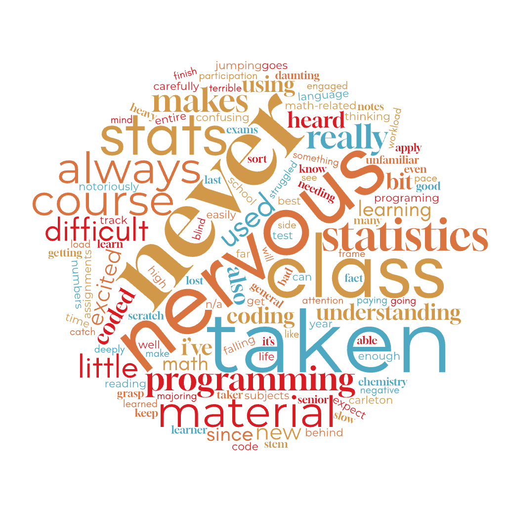

```{r setup, include=FALSE}
library(tidyverse)
library(patchwork)
library(tidytext)
knitr::opts_chunk$set(warning = FALSE, message = FALSE, echo = FALSE, fig.align = 'center', fig.width = 10, fig.height = 6)
theme_set(theme_minimal(base_size = 18, base_family = "Source Sans 3"))
```

## Today:

1. A pep talk
1. Meet your groups!
1. Intro to data/Notes 01
2. Samples and Populations
3. Sampling/RStudio Activity

## What makes you nervous about this class?

{fig-align="center"}

```{r, echo = FALSE}
survey = googlesheets4::read_sheet("https://docs.google.com/spreadsheets/d/1Svn_Ag2gOKlYRABCVJnR1MSCh2uENoUW9hjeLCdQuV8/edit?usp=sharing")
survey$stats = survey$`Have you taken a statistics course before?`
survey$cs = survey$`Have you taken a programming course before?`
```

```{r, echo = FALSE}
#data(stop_words)
#survey %>%
#  select(nervous) %>%
#  mutate(student = 1:n()) %>% 
#  unnest_tokens(word, nervous, token = "ngrams", n = 1) %>%
#  anti_join(stop_words) %>%
#  count(word, sort = TRUE)
```

## Have you taken a stats class before?

```{r}
survey %>% 
  mutate(stats2 = ifelse(str_detect(stats, "Yes"), "Yes", "No")) %>%
  ggplot(aes(y = stats2, fill = stats2)) +
  geom_bar() + 
  labs(x = "",
       y = "") + 
  theme(legend.position = "none") + 
  scale_fill_viridis_d(end = .75)
```

## How familiar are you with the following tools? 

```{r}
survey %>% 
  select(`How familiar are you with the following tools: [R]`, 
         `How familiar are you with the following tools: [RMarkdown]`,
         `How familiar are you with the following tools: [RStudio]`) |>
  pivot_longer(everything()) |>
  mutate(
    name = str_remove(name, "How familiar are you with the following tools: ")
  ) |>
  ggplot(aes(y = name, fill = value)) +
  geom_bar() + 
  labs(x = "",
       y = "",
       fill = "") + 
  theme(legend.position = "bottom") + 
  scale_fill_viridis_d(end = .75)
```

# Meet your groups! {.maize}

# In your groups: 

1. Try to figure out what shared interest you all listed in the survey
2. Complete the academic honesty and group expectations worksheet

# Data Recap {.maize}

# Samples and Populations {.maize}

## Consider the following research questions: 

1. What is the average mercury content of swordfish in the Atlantic Ocean? 
2. Over the last five years, what is the average time to complete a degree for undergraduates in Minnesota? How does it compare to other states?
3. Does a new drug reduce the heart attack rate in patients with severe heart disease? 

## 3 Possible Responses: 

1. A man on the news got mercury poisoning from eating swordfish, so it must be dangerously high. 
2. I met two students who took less than 4 years to graduate, so it must take less time to graduate in Minnesota than in other states.
3. My friend's father had a heart attack after taking the new drug for six months, so it must not work

## The big picture

The ultimate goal of statistics is to learn about a population using a subset of that population. But, populations are *hard* (sometimes impossible!) to measure. 


```{r}
#| fig-width: 16
#| fig-height: 8


# Used gemini to fiddle with arrows 
library(ggwaffle)
library(emojifont)  

set.seed(033126)

waffle_data <- tibble(
  x = runif(200),
  y = runif(200),
  index = 1:200, 
  col = sample(c("no","yes"), size = 200, replace = TRUE, prob = c(.95, .05))
)

waffle_data$label = fontawesome('fa-user')

p1 <- ggplot(waffle_data, aes(x, y, colour = col)) + 
  geom_text(aes(label=label), family='fontawesome-webfont', size=16) +
  coord_equal() + 
  scale_colour_manual(values = c("lightgreen", "darkgreen")) +
  theme_waffle()  +
  theme(legend.position = "none") + 
  labs(
    x = "",
    y = ""
  )

p_arrow <- ggplot() +
  geom_segment(
    aes(x = 0.1, y = 0.5, xend = 0.9, yend = 0.5), 
    arrow = arrow(length = unit(0.5, "cm"), type = "closed"), 
    linewidth = 1.5, 
    color = "black"
  ) +
  theme_void() + # This removes all axes, gridlines, and backgrounds
  coord_cartesian(xlim = c(0, 1), ylim = c(0, 1)) # Keeps the arrow centered

p2 <- tibble(
  x = rep(1:5/6, 2),
  y = rep(1:2/3, each = 5),
  col = "yes",
  label = fontawesome('fa-user')
  ) |>
  ggplot(aes(x, y)) + 
  geom_text(aes(label=label), family='fontawesome-webfont', size=16, color = "darkgreen") +
  coord_equal(xlim = c(0, 1), ylim = c(0, 1)) +
  theme_waffle()  +
  theme(legend.position = "none") + 
  labs(
    x = "",
    y = ""
  )

p_inference <- ggplot() +
  # Swap geom_segment for geom_curve
  geom_curve(
    aes(x = 0.85, y = 0.4, xend = 0.15, yend = 0.4), 
    curvature = -0.2, # Positive values curve one way, negative values curve the other
    arrow = arrow(length = unit(0.5, "cm"), type = "closed"), 
    linewidth = 1.5, 
    color = "black"
  ) +
  # Adjust the y-coordinate of the text so it sits neatly under the arch
  geom_text(
    aes(x = 0.5, y = 0.15, label = "Inference"), 
    size = 20, 
    fontface = "italic",
    color = "darkgreen"
  ) +
  theme_void() + 
  coord_cartesian(xlim = c(0, 1), ylim = c(-1, 1), clip = "off")

# Define the grid layout map
# A = p1 (takes up 2 spaces)
# B = p_arrow (takes up 1 space)
# C = p2 (takes up 1 space)
# D = p_inference (spans all 4 spaces on the bottom row)
layout <- "
AABC
DDDD
"

p1 + p_arrow + p2 + p_inference + 
  plot_layout(
    design = layout, 
    heights = c(5, 1) # Makes the top row 5x taller than the bottom arrow row
  )  
```

## Spectrum of Samples

```{r}
#| fig-width: 10
#| fig-height: 4

# Made with gemini

library(ggplot2)
library(patchwork)
library(dplyr)
library(emojifont)

set.seed(42) # For reproducible random colors

# ---------------------------------------------------------
# 1. n=1 ("Anec-data")
# ---------------------------------------------------------
p1_data <- tibble(x = 1, y = 1, label = fontawesome('fa-user'))

p1 <- ggplot(p1_data, aes(x, y)) +
  geom_text(aes(label = label), family = 'fontawesome-webfont', size = 25, color = "#2b8cbe") +
  coord_equal(xlim = c(0, 2), ylim = c(0, 2)) +
  theme_void() +
  ggtitle('"Anec-data"\nn=1') +
  theme(plot.title = element_text(hjust = 0.5, face = "bold", size = 22))

# ---------------------------------------------------------
# 2. Small Sample (n=5)
# ---------------------------------------------------------
p2_data <- tibble(
  x = c(1, 2, 3, 1.5, 2.5),
  y = c(1, 1, 1, 2, 2),
  label = fontawesome('fa-user')
)

p2 <- ggplot(p2_data, aes(x, y)) +
  geom_text(aes(label = label), family = 'fontawesome-webfont', size = 12, color = "#41ab5d") +
  coord_equal(xlim = c(0, 4), ylim = c(0, 3)) +
  theme_void() +
  ggtitle('Small Sample') +
  theme(plot.title = element_text(hjust = 0.5, face = "bold", size = 22))

# ---------------------------------------------------------
# 3. Moderate Sample (n=100 as a 10x10 grid)
# ---------------------------------------------------------
p3_data <- expand.grid(x = 1:10, y = 1:10) |>
  mutate(
    label = fontawesome('fa-user'),
    # Randomly assign a few colors to show variation
    color = sample(c("#41ab5d", "#ec7014", "#2b8cbe", "#807dba"), 100, replace = TRUE)
  )

p3 <- ggplot(p3_data, aes(x, y, color = color)) +
  geom_text(aes(label = label), family = 'fontawesome-webfont', size = 5) +
  scale_color_identity() +
  coord_equal() +
  theme_void() +
  ggtitle('Moderate Sample') +
  theme(plot.title = element_text(hjust = 0.5, face = "bold", size = 22))

# ---------------------------------------------------------
# 4. Large Sample (n=400 as a 20x20 grid)
# ---------------------------------------------------------
# Note: Rendering 1000 icons can make R run very slowly. 
# A 20x20 grid (400) provides the exact same visual impact for a slide!
p4_data <- expand.grid(x = 1:20, y = 1:20) |>
  mutate(
    label = fontawesome('fa-user'),
    color = sample(c("#41ab5d", "#ec7014", "#2b8cbe", "#807dba", "#d73027"), 400, replace = TRUE)
  )

p4 <- ggplot(p4_data, aes(x, y, color = color)) +
  geom_text(aes(label = label), family = 'fontawesome-webfont', size = 2.5) +
  scale_color_identity() +
  coord_equal() +
  theme_void() +
  ggtitle('Large Sample') +
  theme(plot.title = element_text(hjust = 0.5, face = "bold", size = 22))
  

# ---------------------------------------------------------
# 5. Entire Population / Census (Dense uniform grid)
# ---------------------------------------------------------
p5_data <- expand.grid(x = 1:25, y = 1:25) |>
  mutate(label = fontawesome('fa-user'))

p5 <- ggplot(p5_data, aes(x, y)) +
  geom_text(aes(label = label), family = 'fontawesome-webfont', size = 2, color = "grey40") +
  coord_equal() +
  theme_void() +
  ggtitle('Entire Population:\n"Census"') +
  theme(plot.title = element_text(hjust = 0.5, face = "bold", size = 22))

# ---------------------------------------------------------
# 6. The Connecting Arrow (Bottom spanning plot)
# ---------------------------------------------------------
p_arrow <- ggplot() +
  # Main spectrum arrow
  geom_segment(
    aes(x = 0.05, y = 0.5, xend = 0.95, yend = 0.5), 
    arrow = arrow(length = unit(0.4, "cm"), type = "closed"), 
    linewidth = 2, 
    color = "#525252"
  ) +
  # Text above the arrow
  geom_text(
    aes(x = 0.5, y = 0.8, label = "Increasing Sample Size (n)"), 
    size = 15, 
    fontface = "italic",
    color = "#525252"
  ) +
  theme_void() + 
  coord_cartesian(xlim = c(0, 1), ylim = c(0, 1))

# ---------------------------------------------------------
# 7. Stitch it all together with Patchwork
# ---------------------------------------------------------
# We put the 5 plots in one row, and the arrow underneath them
layout <- "
ABCDE
FFFFF
"

(p1 | p2 | p3 | p4 | p5) / p_arrow + 
  plot_layout(
    #design = layout, 
    heights = c(4, 1) # Makes the icons take up 80% of the height, the arrow takes 20%
  )
```

## Definitions

::: callout-note
## Population

Includes all units of interest

:::

::: callout-note
## Sample

Subset of the population
:::

::: callout-note
## Statistical Inference

Using a sample to learn about the population
:::

::: callout-note
## Parameters and Statistics

*Parameters* are quantities that describe the population (like a mean). *Statistics* are corresponding quantities that describe a sample. 
:::

# Examples

## Identify the **sample mean** and (claimed) **population mean**

::: {.r-stack}

::: {.fragment .fade-in-then-out}
American households spent an average of about \$52 in 2007 on Halloween merchandise such as costumes, decorations, and candy. To see if this number had changed, researchers conducted a new survey in 2008 before industry numbers were reported. The survey included 1,500 households and found that average Halloween spending was \$58 per household.
:::

::: {.fragment .fade-in-then-out}
The average GPA of students in 2001 at a private university was 3.37. A survey on a sample of 203 students from this university yielded an average GPA of 3.59 a decade later.
:::

::: {.fragment .fade-in-then-out}
A recent article in a college newspaper stated that college students get an average of 5.5 hours of sleep each night. A student who was skeptical about this value decided to conduct a survey by randomly sampling 25 students. On average, the sampled students slept 6.25 hours per night
:::

:::

## What's wrong?

I'm interested in how satisfied the Carleton community is with the fitness center. I decide I need a sample size of 100, so at 6am one morning, I stand outside the entrance ask the first 100 people who exit whether or not they enjoyed their workout. They all said yes, so I conclude the fitness center is a perfect facility.

## What's wrong?

75% of online reviews for a product are negative, so 75% of buyers are dissatisfied with the product. 

## 

::: callout-note
## Simple Random Sample

All groups of size $n$ have an equal chance of being selected
:::

::: callout-note
## Bias

Occurs when the method of collecting data causes the sample to inaccurately represent the population
:::

## 

::: callout-note
## Undercoverage

Part of the population has less representation in the sample
:::

::: callout-note
## Voluntary Response

Individuals choose whether or not to participate
:::

::: callout-note
## Convenience Sample

Sample consists of units that are "easy" to sample
:::

::: callout-note
## Non-response bias

Large fraction of the selected sample do not respond/participate
:::

# Activity: Mission Statement {.maize}

# Activity: Mission Statement in R {.maize}

