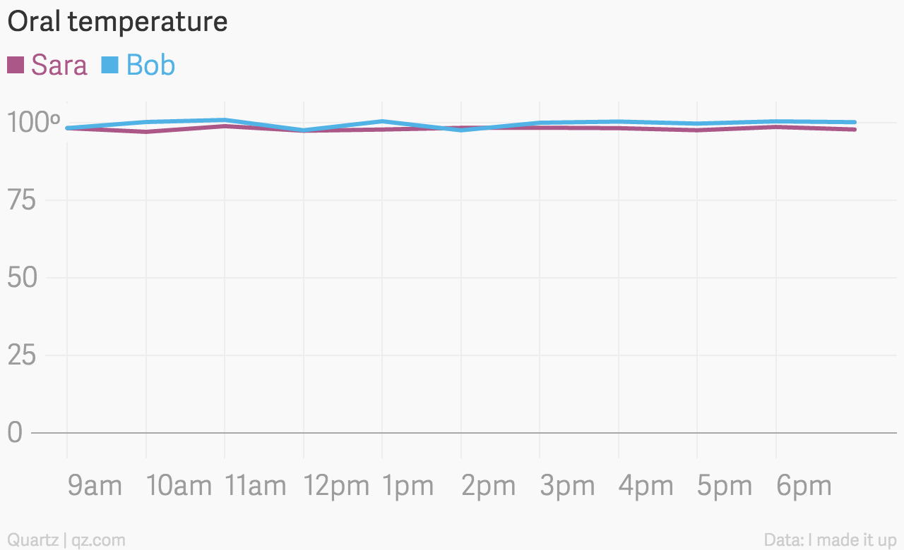
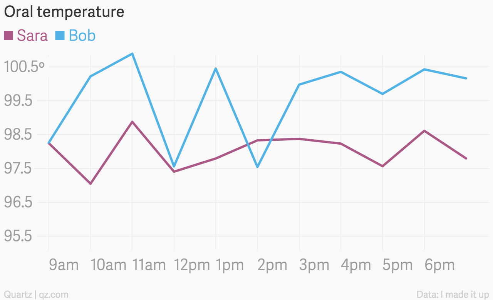
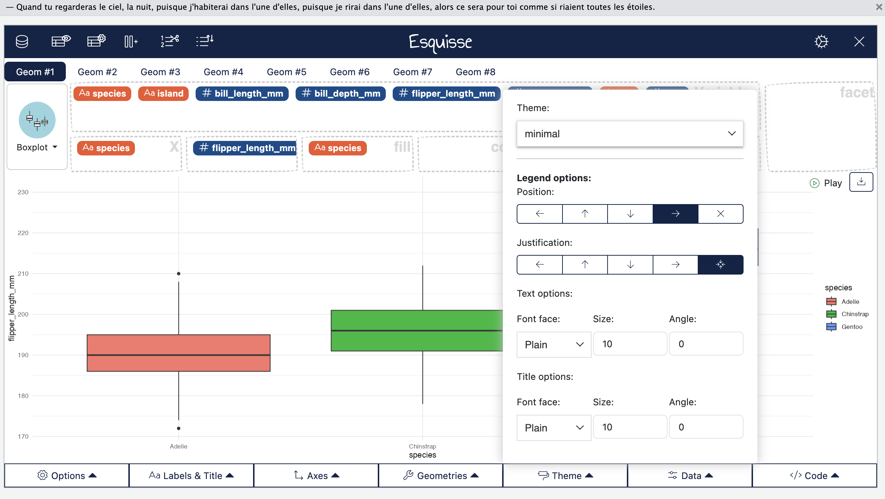
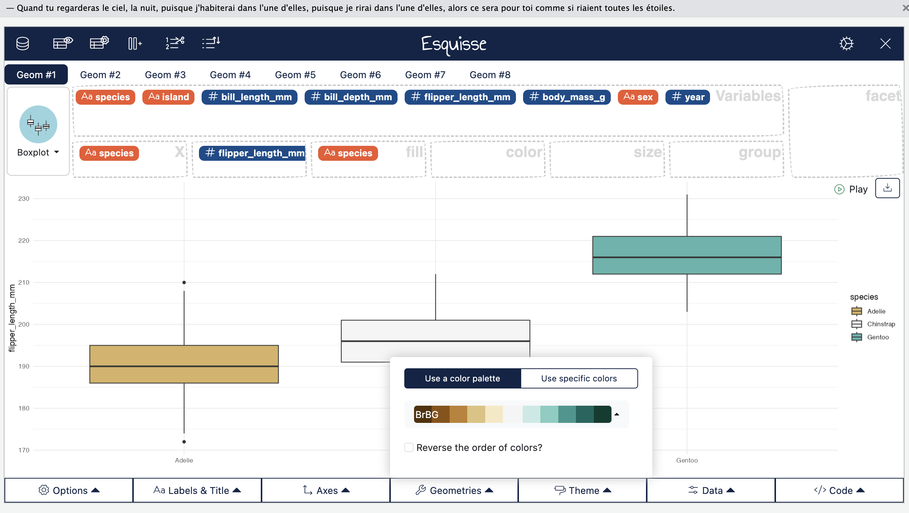
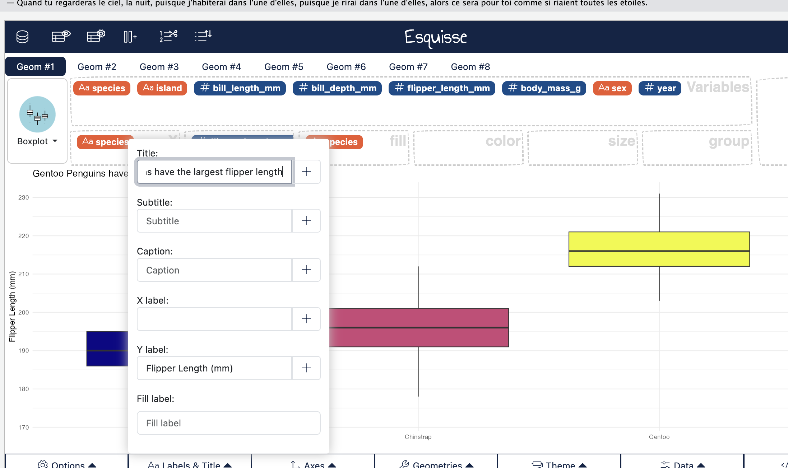

```{r setup, include=FALSE}
library(tidyverse)
library(xaringanthemer)
library(patchwork)
library(palmerpenguins)
knitr::opts_chunk$set(warning = FALSE, message = FALSE, echo = FALSE, fig.align = 'center', fig.width = 10, fig.height = 6)
options(htmltools.dir.version = FALSE, htmltools.preserve.raw = FALSE)
slides_theme = theme_minimal(
  base_family = "Source Sans 3",
  base_size = 20)
theme_set(slides_theme)
```


## Today: 

1. Customizing ggplots
2. Exam Review

# Customizing ggplots

We've focused on a few main forms of `ggplots`: bar plots, histograms, box plots, and scatterplots. There are *many* other types of plots, and once you know the basics of the grammar, it's easy to move between them. 

## Choice of graphical form

Let's say we want to graphically display the mean flipper length for each penguin species. One way we could do that is with a barplot: 

```{r}
library(palmerpenguins)
bar_mean = penguins %>%
  group_by(species) %>%
  summarize(
    mean_flipper_length = mean(flipper_length_mm, na.rm = T)
  ) %>%
  ggplot(., aes(x = species, y = mean_flipper_length, fill = species)) +
  geom_col() +
  theme(legend.position = "none")

bar_mean
```

## Choice of graphical form 

Or we could show the full distribution with the mean overlaid

```{r}
scatter_mean = penguins %>%
  ggplot(., aes(x = species, y = flipper_length_mm, fill = species, col = species)) + 
  ggbeeswarm::geom_beeswarm(alpha = .5) + 
  stat_summary(
    fun = mean, 
    fun.min = mean, 
    fun.max = mean, 
    geom = "errorbar", 
    width = 0.75, 
    linewidth = 1
  )

scatter_mean
```

## Choice of graphical form 

```{r}
bar_mean + scatter_mean
```

## Distorting the y-axis

:::: {.columns}

::: {.column width="50%"}
```{r}

```
:::

::: {.column width="50%"}
```{r}

```
:::

::::

## Adding transparency with `alpha`

```{r}
theme_set(theme_gray())
```

```{r}
#| echo: true
#| layout-ncol: 2
#| fig-width: 4.5
#| fig-height: 3


ggplot(penguins, aes(x = species, y = flipper_length_mm, fill = species, col = species)) + 
  geom_jitter(width = .2) + 
  geom_boxplot()

ggplot(penguins, aes(x = species, y = flipper_length_mm, fill = species, col = species)) + 
  geom_jitter(alpha = .2, width = .2) + 
  geom_boxplot(alpha = .5)
```


## Changing {ggplot} theme

```{r}
library(ggthemes)
p1 <- ggplot(penguins, aes(x = species, y = flipper_length_mm, fill = species, col = species)) + 
  geom_jitter(alpha = .2, width = .2) + 
  geom_boxplot(alpha = .5) +
  theme_bw() + 
  labs(title = "theme_classic()")

p2 <- ggplot(penguins, aes(x = species, y = flipper_length_mm, fill = species, col = species)) + 
  geom_jitter(alpha = .2, width = .2) + 
  geom_boxplot(alpha = .5) +
  theme_minimal() + 
  labs(title = "theme_minimal()")

p3 <- ggplot(penguins, aes(x = species, y = flipper_length_mm, fill = species, col = species)) + 
  geom_jitter(alpha = .2, width = .2) + 
  geom_boxplot(alpha = .5) +
  theme_dark() + 
  labs(title = "theme_dark()")

p4 <- ggplot(penguins, aes(x = species, y = flipper_length_mm, fill = species, col = species)) + 
  geom_jitter(alpha = .2, width = .2) + 
  geom_boxplot(alpha = .5) +
  theme_wsj() + 
  labs(title = "theme_economist()")

p1 + p2 + p3 + p4
```


## Changing {ggplot} color palette

```{r}
library(ggthemes)
p1 <- ggplot(penguins, aes(x = species, y = flipper_length_mm, fill = species, col = species)) + 
  geom_jitter(alpha = .2, width = .2) + 
  geom_boxplot(alpha = .5) +
  scale_fill_brewer(palette = "Greens") + 
  scale_color_brewer(palette = "Greens") + 
  theme_bw() + 
  labs(title = "scale_fill_brewer(palette = 'Greens')")

p2 <- ggplot(penguins, aes(x = species, y = flipper_length_mm, fill = species, col = species)) + 
  geom_jitter(alpha = .2, width = .2) + 
  geom_boxplot(alpha = .5) +
  scale_fill_brewer(palette = "Set1") + 
  scale_color_brewer(palette = "Set1") + 
   theme_bw() + 
  labs(title = " scale_fill_brewer(palette = 'Set1')")

p3 <- ggplot(penguins, aes(x = species, y = flipper_length_mm, fill = species, col = species)) + 
  geom_jitter(alpha = .2, width = .2) + 
  geom_boxplot(alpha = .5) +
  scale_fill_viridis_d() + 
  scale_color_viridis_d() + 
   theme_bw() + 
  labs(title = "scale_fill_viridis_d()")

p4 <- ggplot(penguins, aes(x = species, y = flipper_length_mm, fill = species, col = species)) + 
  geom_jitter(alpha = .2, width = .2) + 
  geom_boxplot(alpha = .5) +
  scale_fill_viridis_d(option ="plasma", end = .75) + 
  scale_color_viridis_d(option ="plasma", end = .75) + 
   theme_bw() + 
  labs(title = "scale_fill_viridis_d(option ='plasma')")

p1 + p2 + p3 + p4
```


## (re)moving the legend

```{r}
#| echo: false
p1 <- ggplot(penguins, aes(x = species, y = flipper_length_mm, fill = species, col = species)) + 
  geom_jitter(alpha = .2, width = .2) + 
  geom_boxplot(alpha = .5) +
  scale_fill_viridis_d(option ="plasma", end = .75) + 
  scale_color_viridis_d(option ="plasma", end = .75) + 
  theme_bw() + 
  labs(title = "")

p2 <- ggplot(penguins, aes(x = species, y = flipper_length_mm, fill = species, col = species)) + 
  geom_jitter(alpha = .2, width = .2) + 
  geom_boxplot(alpha = .5) +
  scale_fill_viridis_d(option ="plasma", end = .75) + 
  scale_color_viridis_d(option ="plasma", end = .75) + 
   theme_bw() + 
  theme(legend.position = "bottom") + 
  labs(title = "theme(legend.position = 'bottom')")
  
p3 <- ggplot(penguins, aes(x = species, y = flipper_length_mm, fill = species, col = species)) + 
  geom_jitter(alpha = .2, width = .2) + 
  geom_boxplot(alpha = .5) +
  scale_fill_viridis_d(option ="plasma", end = .75) + 
  scale_color_viridis_d(option ="plasma", end = .75) + 
   theme_bw() + 
  theme(legend.position = "none") + 
  labs(title = "theme(legend.position = 'none')")
  
p1 / (p2 | p3) 

```

## Customizing labels

```{r}
#| echo: true
ggplot(penguins, aes(x = species, y = flipper_length_mm, fill = species)) + 
  geom_jitter(alpha = .2) + 
  geom_boxplot(alpha = .5) +
  theme_minimal(base_size = 20) + 
  scale_fill_viridis_d(option ="plasma") + 
  theme(legend.position = "none") + 
  labs(
    title = "Gentoo Penguins have the longest flipper lengths",
    subtitle = "Adelie and Chinstrap Penguins are smaller",
    y = "Flipper Length (mm)",
    x = "",
    caption = "Source: PalmerPenguins"
  )
```

## In `esquisse`

Change theme under the "theme" menu:

```{r}

```

## In `esquisse`

Change color palette under the "geometries" menu:

```{r}

```

## In `esquisse`

Change title and axis labels under the "labels and title" menu:

```{r}

```

## Organizing plots

::: {.panel-tabset}

## Original

```{r}
#| echo: true


ggplot(penguins, aes(x = flipper_length_mm)) + 
  geom_histogram(col = "white")

ggplot(penguins, aes(x = body_mass_g)) + 
  geom_histogram(col = "white")

ggplot(penguins, aes(x = bill_length_mm)) + 
  geom_histogram(col = "white")
```

## Combined

```{r}
#| echo: true
#| fig-width: 8
#| fig-height: 3


p1 <- ggplot(penguins, aes(x = flipper_length_mm)) + 
  geom_histogram(col = "white")

p2 <- ggplot(penguins, aes(x = body_mass_g)) + 
  geom_histogram(col = "white")

p3 <- ggplot(penguins, aes(x = bill_length_mm)) + 
  geom_histogram(col = "white")

p1 + p2 + p3
```

:::

# Exam Review {.maize}

# Exam 1 Check-in forms {.maize}
